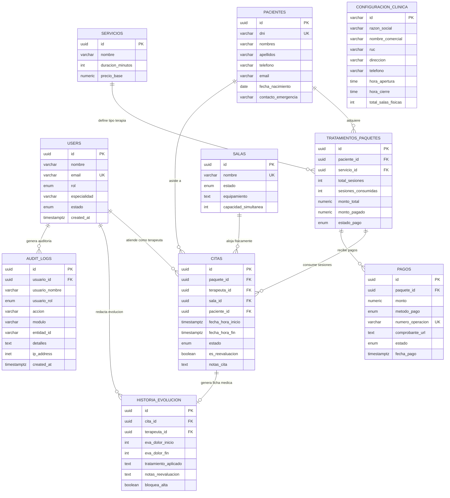

# Modelo Relacional de Base de Datos - KineFlow Core
## Centro Especializado: AJ Fisioterapia (San Borja)

Este documento contiene la especificación formal del **Modelo Lógico Relacional** y el **Diccionario de Datos** del sistema de gestión clínica y operativa de AJ Fisioterapia.

---

## 1. Diagrama Entidad-Relación (DER / Relational Diagram)

---

## 2. Esquema Lógico Relacional (Notación Formal Académica)

En el estándar de bases de datos relacionales (Codd), el esquema lógico se representa indicando las claves primarias subrayadas (**PK**) y las claves foráneas (**FK**):

1. **USERS** (<ins>id</ins>, nombre, email, rol, especialidad, telefono, estado, created_at, updated_at)
2. **PACIENTES** (<ins>id</ins>, dni, nombres, apellidos, telefono, email, fecha_nacimiento, contacto_emergencia, created_at, updated_at)
3. **SALAS** (<ins>id</ins>, nombre, estado, equipamiento, capacidad_simultanea, created_at, updated_at)
4. **SERVICIOS** (<ins>id</ins>, nombre, duracion_minutos, precio_base, created_at, updated_at)
5. **TRATAMIENTOS_PAQUETES** (<ins>id</ins>, *paciente_id* [FK -> PACIENTES.id], *servicio_id* [FK -> SERVICIOS.id], total_sesiones, sesiones_consumidas, monto_total, monto_pagado, estado_pago, created_at, updated_at)
6. **CITAS** (<ins>id</ins>, *paquete_id* [FK -> TRATAMIENTOS_PAQUETES.id], *terapeuta_id* [FK -> USERS.id], *sala_id* [FK -> SALAS.id], *paciente_id* [FK -> PACIENTES.id], fecha_hora_inicio, fecha_hora_fin, estado, es_reevaluacion, notas_cita, created_at, updated_at)
7. **PAGOS** (<ins>id</ins>, *paquete_id* [FK -> TRATAMIENTOS_PAQUETES.id], monto, metodo_pago, numero_operacion, comprobante_url, estado, fecha_pago, created_at, updated_at)
8. **HISTORIA_EVOLUCION** (<ins>id</ins>, *cita_id* [FK -> CITAS.id], *terapeuta_id* [FK -> USERS.id], eva_dolor_inicio, eva_dolor_fin, tratamiento_aplicado, notas_reevaluacion, bloquea_alta, created_at, updated_at)
9. **AUDIT_LOGS** (<ins>id</ins>, *usuario_id* [FK -> USERS.id], usuario_nombre, usuario_rol, accion, modulo, entidad_id, detalles, ip_address, created_at)
10. **CONFIGURACION_CLINICA** (<ins>id</ins>, razon_social, nombre_comercial, ruc, direccion, telefono, whatsapp, hora_apertura, hora_cierre, intervalo_minutos, frecuencia_reevaluacion, bloqueo_alta_reevaluacion, total_salas_fisicas, updated_at)

---

## 3. Diccionario de Datos / Especificación de Tablas

### Tabla 1: `users` (Personal y Roles RBAC)
| Campo | Tipo | Nulo | Llave | Descripción / Restricciones |
| :--- | :--- | :---: | :---: | :--- |
| `id` | UUID | NO | **PK** | Identificador único universal (`gen_random_uuid()`) |
| `nombre` | VARCHAR(150) | NO | | Nombre completo del profesional o administrativo |
| `email` | VARCHAR(150) | NO | **UK** | Correo electrónico corporativo único |
| `rol` | ENUM | NO | | `ADMIN`, `RECEPCION`, `TERAPEUTA`, `PACIENTE` |
| `especialidad`| VARCHAR(150) | SÍ | | Título profesional (ej: Terapia Manual, Neurorehabilitación) |
| `estado` | ENUM | NO | | `ACTIVO`, `INACTIVO` |

---

### Tabla 2: `pacientes` (Directorio y Expediente)
| Campo | Tipo | Nulo | Llave | Descripción / Restricciones |
| :--- | :--- | :---: | :---: | :--- |
| `id` | UUID | NO | **PK** | Identificador único del paciente |
| `dni` | VARCHAR(12) | NO | **UK** | Documento Nacional de Identidad (CHECK 8 dígitos) |
| `nombres` | VARCHAR(100) | NO | | Nombres de pila |
| `apellidos` | VARCHAR(100) | NO | | Apellidos paterno y materno |
| `telefono` | VARCHAR(25) | NO | | Celular para notificaciones de citas |
| `fecha_nacimiento`| DATE | NO | | Cálculo de edad clínica |
| `contacto_emergencia`| VARCHAR(150) | SÍ | | Nombre y número de familiar responsable |

---

### Tabla 3: `salas` (Capacidad Física Instalada)
| Campo | Tipo | Nulo | Llave | Descripción / Restricciones |
| :--- | :--- | :---: | :---: | :--- |
| `id` | UUID | NO | **PK** | Identificador de la sala |
| `nombre` | VARCHAR(50) | NO | **UK** | Nombre único ("Sala 1" a "Sala 6" en San Borja) |
| `estado` | ENUM | NO | | `DISPONIBLE`, `MANTENIMIENTO` |
| `equipamiento`| TEXT | SÍ | | Agentes físicos instalados (Láser, TENS, Magneto) |
| `capacidad_simultanea`| INT | NO | | Número máximo de pacientes en simultáneo (Default 1) |

---

### Tabla 4: `servicios` (Catálogo Clínico)
| Campo | Tipo | Nulo | Llave | Descripción / Restricciones |
| :--- | :--- | :---: | :---: | :--- |
| `id` | UUID | NO | **PK** | Identificador del servicio |
| `nombre` | VARCHAR(150) | NO | | Nombre del tratamiento |
| `duracion_minutos`| INT | NO | | Duración de sesión en minutos (Default 45) |
| `precio_base` | NUMERIC(10,2)| NO | | Tarifa en Soles (PEN) con validación `> 0` |

---

### Tabla 5: `tratamientos_paquetes` (Venta de Sesiones)
| Campo | Tipo | Nulo | Llave | Descripción / Restricciones |
| :--- | :--- | :---: | :---: | :--- |
| `id` | UUID | NO | **PK** | Identificador del paquete contratado |
| `paciente_id` | UUID | NO | **FK** | Referencia a `pacientes.id` |
| `servicio_id` | UUID | NO | **FK** | Referencia a `servicios.id` |
| `total_sesiones`| INT | NO | | Modalidad: 1, 10 o 20 sesiones |
| `sesiones_consumidas`| INT | NO | | Conteo de sesiones atendidas (`<= total_sesiones`) |
| `monto_total` | NUMERIC(10,2)| NO | | Costo total del paquete |
| `monto_pagado`| NUMERIC(10,2)| NO | | Sumatoria acumulada de cobranzas |
| `estado_pago` | ENUM | NO | | `PENDIENTE`, `PARCIAL`, `PAGADO` |

---

### Tabla 6: `citas` (Agenda y Concurrencia de Salas)
| Campo | Tipo | Nulo | Llave | Descripción / Restricciones |
| :--- | :--- | :---: | :---: | :--- |
| `id` | UUID | NO | **PK** | Identificador de la cita |
| `paquete_id` | UUID | SÍ | **FK** | Referencia a `tratamientos_paquetes.id` (o sesión suelta) |
| `terapeuta_id`| UUID | NO | **FK** | Referencia a `users.id` (Fisioterapeuta a cargo) |
| `sala_id` | UUID | NO | **FK** | Referencia a `salas.id` (Sala 1 a 6) |
| `paciente_id` | UUID | NO | **FK** | Referencia a `pacientes.id` |
| `fecha_hora_inicio`| TIMESTAMPTZ| NO | | Inicio de la sesión |
| `fecha_hora_fin` | TIMESTAMPTZ| NO | | Fin de la sesión (`fin > inicio`) |
| `estado` | ENUM | NO | | `PROGRAMADA`, `CONFIRMADA`, `ATENDIDA`, `CANCELADA`, `NO_ASISTIO` |
| `es_reevaluacion`| BOOLEAN | NO | | Flag automático cada 5 sesiones |

> **Restricción de Integridad GiST (Nivel Senior):**
> * `EXCLUDE USING gist (sala_id WITH =, tstzrange(fecha_hora_inicio, fecha_hora_fin) WITH &&)`: Impide a nivel de base de datos que dos citas compartan la misma sala al mismo tiempo.
> * `EXCLUDE USING gist (terapeuta_id WITH =, tstzrange(fecha_hora_inicio, fecha_hora_fin) WITH &&)`: Impide que un terapeuta sea programado en dos salas simultáneamente.

---

### Tabla 7: `pagos` (Caja y Conciliación)
| Campo | Tipo | Nulo | Llave | Descripción / Restricciones |
| :--- | :--- | :---: | :---: | :--- |
| `id` | UUID | NO | **PK** | Identificador del comprobante de ingreso |
| `paquete_id` | UUID | NO | **FK** | Referencia a `tratamientos_paquetes.id` |
| `monto` | NUMERIC(10,2)| NO | | Importe cobrado (`> 0`) |
| `metodo_pago` | ENUM | NO | | `EFECTIVO`, `YAPE`, `PLIN`, `POS` |
| `numero_operacion`| VARCHAR(60)| SÍ | **UK** | Código de transacción digital para conciliación |
| `estado` | ENUM | NO | | `VERIFICADO`, `PENDIENTE` |
| `fecha_pago` | TIMESTAMPTZ| NO | | Fecha y hora exacta de recepción |

---

### Tabla 8: `historia_evolucion` (Evolución Clínica y Escala EVA)
| Campo | Tipo | Nulo | Llave | Descripción / Restricciones |
| :--- | :--- | :---: | :---: | :--- |
| `id` | UUID | NO | **PK** | Identificador de la nota clínica |
| `cita_id` | UUID | NO | **FK, UK**| Relación 1 a 1 estricta con la cita asistida |
| `terapeuta_id`| UUID | NO | **FK** | Profesional que ejecutó la sesión |
| `eva_dolor_inicio`| INT | NO | | Escala Visual Analógica de dolor al entrar (0 a 10) |
| `eva_dolor_fin` | INT | NO | | Escala Visual Analógica de dolor al salir (0 a 10) |
| `tratamiento_aplicado`| TEXT | NO | | Descripción de técnicas, agentes y ejercicios realizados |
| `bloquea_alta` | BOOLEAN | NO | | Si es `true`, impide el alta hasta acreditar reevaluación |

---

### Tabla 9: `audit_logs` (Trazabilidad Inmutable)
| Campo | Tipo | Nulo | Llave | Descripción / Restricciones |
| :--- | :--- | :---: | :---: | :--- |
| `id` | UUID | NO | **PK** | Identificador del log |
| `usuario_id` | UUID | SÍ | **FK** | Usuario responsable de la acción |
| `usuario_nombre`| VARCHAR(150)| NO | | Snapshot del nombre del usuario |
| `usuario_rol` | ENUM | NO | | Rol al momento de la acción |
| `accion` | VARCHAR(60) | NO | | `CITA_CREADA`, `PAGO_REGISTRADO`, `ASISTENCIA_REGISTRADA`, etc. |
| `modulo` | VARCHAR(50) | NO | | `AGENDA`, `CAJA`, `HISTORIA_CLINICA`, `CONFIGURACION` |
| `detalles` | TEXT | NO | | Detalle en lenguaje natural de la operación |
| `created_at` | TIMESTAMPTZ| NO | | Timestamp inmutable |

---

### Tabla 10: `configuracion_clinica` (Parámetros Maestros)
| Campo | Tipo | Nulo | Llave | Descripción / Restricciones |
| :--- | :--- | :---: | :---: | :--- |
| `id` | VARCHAR(50) | NO | **PK** | Clave fija `'config-principal'` (Singleton) |
| `razon_social` | VARCHAR(150)| NO | | Razón social formal ("AJ Fisioterapia S.A.C.") |
| `ruc` | VARCHAR(11) | NO | | RUC tributario (11 dígitos) |
| `hora_apertura` | TIME | NO | | Hora inicio de jornada (08:00) |
| `hora_cierre` | TIME | NO | | Hora fin de jornada (20:00) |
| `frecuencia_reevaluacion`| INT | NO | | Frecuencia obligatoria de control médico (Cada 5 sesiones) |
| `total_salas_fisicas`| INT | NO | | Total de salas en sede (6 salas) |

---

## 4. Matriz de Relaciones y Cardinalidades

| Tabla Origen (1) | Relación | Tabla Destino (N / 1) | Tipo de Vínculo | Regla de Integridad |
| :--- | :---: | :--- | :---: | :--- |
| `pacientes` | **1 : N** | `tratamientos_paquetes` | Un paciente puede contratar múltiples paquetes | `ON DELETE RESTRICT` |
| `servicios` | **1 : N** | `tratamientos_paquetes` | Un servicio puede venderse en muchos paquetes | `ON DELETE RESTRICT` |
| `tratamientos_paquetes` | **1 : N** | `pagos` | Un paquete puede tener varios abonos fraccionados | `ON DELETE CASCADE` |
| `tratamientos_paquetes` | **1 : N** | `citas` | Un paquete programa varias sesiones (10 o 20) | `ON DELETE SET NULL` |
| `pacientes` | **1 : N** | `citas` | Un paciente asiste a múltiples citas | `ON DELETE RESTRICT` |
| `salas` | **1 : N** | `citas` | Una sala física alberga muchas citas en el tiempo | `ON DELETE RESTRICT` |
| `users` (Terapeuta) | **1 : N** | `citas` | Un terapeuta atiende muchas citas | `ON DELETE RESTRICT` |
| `citas` | **1 : 1** | `historia_evolucion` | Cada cita atendida genera una única ficha médica | `ON DELETE CASCADE` |
| `users` | **1 : N** | `audit_logs` | Un usuario genera muchas acciones auditadas | `ON DELETE SET NULL` |
